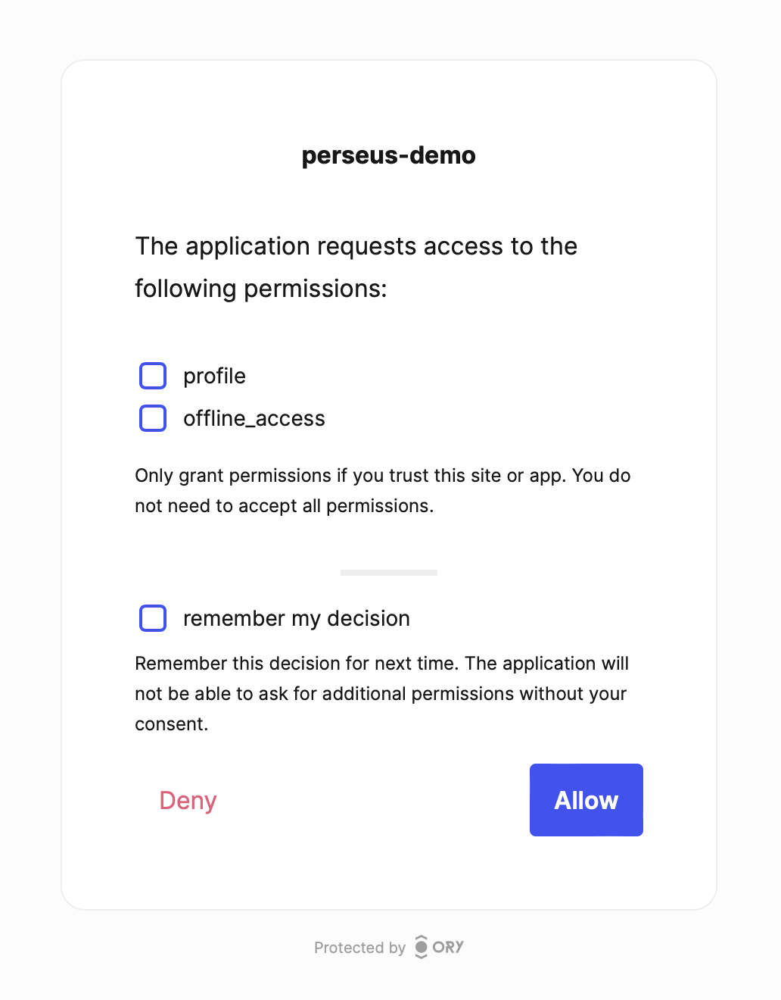
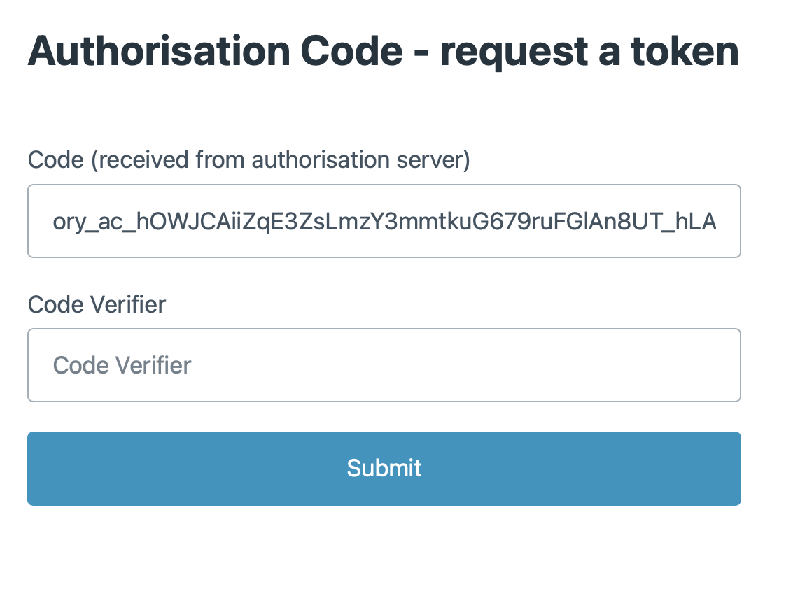
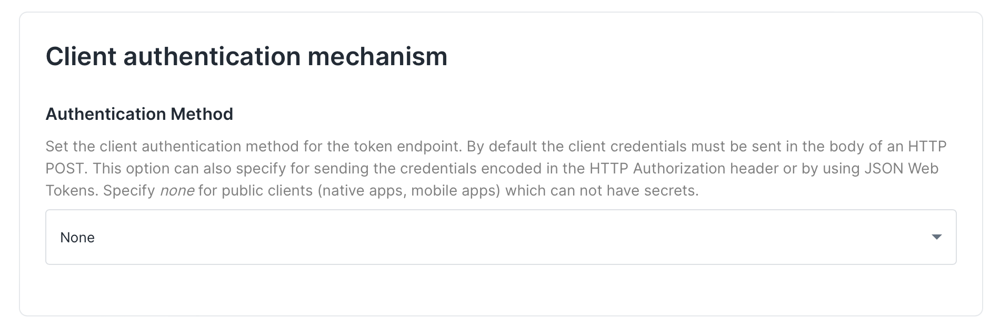
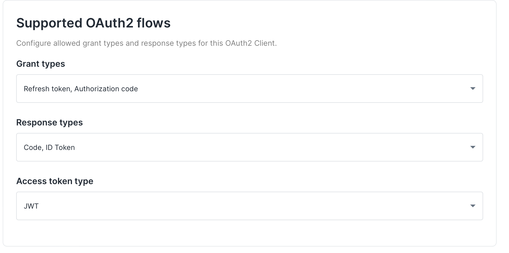
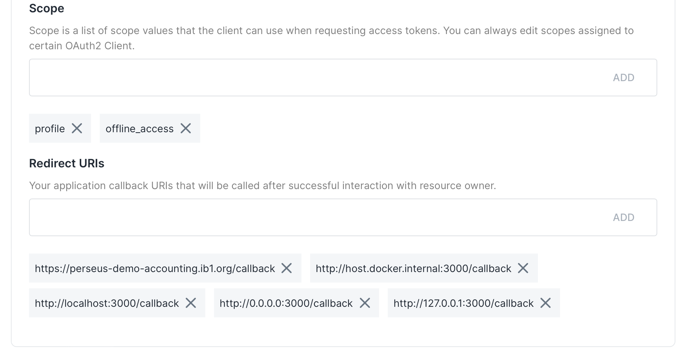
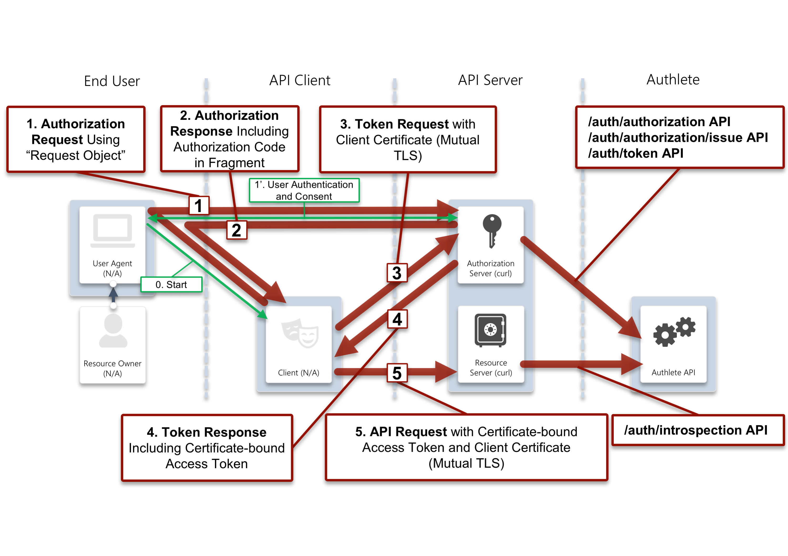

# Perseus demo energy provider

Emulates authentication and resource api endpoints for the Perseus demo. Authentication is built on top of [Ory Hydra](https://www.ory.sh).

## Authentication API

The authentication app is in the [authentication](authentication) directory. It provides endpoints for authenticating and identifying users, and for handling and passing on requests from the client API to the FAPI API. It uses a

Authentication API documentation is available at https://perseus-demo-authentication.ib1.org/api-docs.

## Resource API

The resource api is in the [resource](resource) directory. It demonstrates how to protect an API endpoint using a certificate bound token obtained from the authentication API's interaction with the FAPI provider.

Resource API documentation is available at https://perseus-demo-energy.ib1.org/api-docs.

## Environment variables

Both apps have example `.env.template` files in their root directories. These should be copied to `.env` and edited as required, filling CLIENT_ID and CLIENT_SECRET with the values provided by Ory Hydra, or on request from ib1 for the demo apps.

## Running a dev server

```bash
cd authentication|resource
pipenv install --dev
pipenv run uvicorn api.main:app --reload
```

## Creating self-signed certificates

The docker compose and client.py scripts require a set of self-signed certificates in a certs/ folder. These can be generated using the `certmaker.sh` script in the `scripts` directory.

```bash
cd scripts
./certmaker.sh
```

You will need to create a "certs" directory in the root of the project, and move the generated certificates into it.

### Using client certificates

Most of the endpoints require a client certificate to be presented. As the directory service is not yet available, the contents of the certificate will not be checked with an external CA, so any valid certificate will be acceptable. The certificate **is** used to confirm identity, so the same one must be presented in all requests.

## Creating signing certificates

A separate set of certificates are required for signing JWTs. These can be generated using the `signingcerts.sh` script in the `scripts` directory.

```bash
cd scripts
./signingcerts.sh
```

The default configuration will expect these certificate to be in authentication/api/certs. The location can be changed by setting the DIRECTORY_CERTIFICATE and DIRECTORY_PRIVATE_KEY environment variables.

## Running the local docker environment

The included docker compose file will bring up both APIs. It uses nginx to proxy requests to uvicorn, with nginx configuration to pass through client certificates to the backend, using the same header as used by AWS ALB (`x-amzn-mtls-clientcert`).

```bash
docker-compose up
```

## Pushed Authorization Request (PAR)

As PAR is not available on the Ory Hydra service that this demo is based on, a PAR endpoint has been implemented in this example service. It is expected that production ipmlementations may use the PAR endpoint of their Fapi provider.

In this simple implementation, the request is stored in a redis instance, using a token that matches Fapi requirements as the key.

## Testing the API with client.py

client.py can be used to test authorization code flow, introspection, id_token decoding and retrieving data from the resource URL.

Four commands are available, and are run using:

```bash
python -W ignore  client.py [auth|introspect|id-token|resource]
```

nb. The optional `-W ignore` switch suppresses multiple warnings about the self-signed certificates.

### Auth

Running `client.py auth` will perform the initial steps in the authorization code flow, outputting the URL of a UI to log in and confirm consent. The PKCE code verifier will also be in the output, which will be needed after the redirect

```bash
python -W ignore  client.py auth
```

Example output:

```bash
Code verifier: c6P-FfD0ayLslzCUESCsay8QHEg71O0SnKLeHPkOSyOZ6KubKPRaclM4u5veKcqI7MNqZX_xAUt4CUwIwm4JD99EacbtjAABbyY1i972umU9Ong9HFjtJq84y5mljGFy
https://vigorous-heyrovsky-1trvv0ikx9.projects.oryapis.com/oauth2/auth?client_id=f67916ce-de33-4e2f-a8e3-cbd5f6459c30&response_type=code&redirect_uri=http://127.0.0.1:3000/callback&scope=profile+offline_access&state=9mpb2gDwhp2fLTa_MwJGM21R7FjOQCJq&code_challenge=cksXMlSWrcflDTJoyrpiWX0u2VRV6C--pzetmBIo6LQ&code_challenge_method=S256
```

By default the client will use the local docker environment and expects instances to be running on ports 8000 (authentication) and 8010 (resource). Testing against other endpoints can be achieved by setting the `AUTHENTICATION_API` and `RESOURCE_API` environment variables, eg. to test against the deployed demo:

```bash
AUTHENTICATION_API="https://perseus-demo-authentication.ib1.org" RESOURCE_API=https://perseus-demo-energy.ib1.org python -W ignore  client.py auth
```

Opening the redirect url will present you with the default Ory Hydra log in/ sign up screen, followed by a consent screen:



Granting consent will redirect to our demo client application, with the authorization code appended to the url. The authorization code can be exchanged for an access token by adding the code_verifier value to the form and submitting:



### Client demo app

As an alternative to the command line client, the authorization flow can be completed in a browser at https://perseus-demo-accounting.ib1.org/start. Technical information such as the code verifier, token, and the contents of the introspected token are displayed
at each step.

### Introspection

To show the response of the introspection endpoint, run:

```bash
python -W ignore  client.py introspect --token <token>
```

with token being the `token` value obtained from authorization code flow

### Client side id_token decoding

To show the response of client side id_token decoding, run:

```bash
python -W ignore  client.py id-token --token <token>
```

with token being the `id_token` value obtained from authorization code flow

### Retrieve data from protected endpoint

```bash
python -W ignore  client.py resource --token <token>
```

## Ory Hydra

Please contact [tf-ops@icebreakerone.org](mailto:tf-ops@icebreakerone.org) for the Client ID and secret if you would like to test against our demo Ory account. Alternatively you can set up a free developer account and create an OAuth2 client with your own details. The client should have:

- Authentication method set to None
- Grant types authorization Code and Refresh Token
- Response types Code and ID Token
- Access Token Type jwt
- Scopes profile and offline_access
- Redirect urls to match your production and/or development and local redirect URLs







### Authentication and consent

For this demo, we have used Ory hydra user management platform to provide authentication and consent as part of the authorization code flow. In production, data providers will be using existing user management systems. Whilst some user management platforms may provide OAuth2 endpoints as Ory Hydra does, in other cases the implementation may need to integrate separate OAuth and user management and consent services. Whilst it is outside of the scope this demo to anticipate all possible configurations, the following steps explain how a separate user management and consent service might be integrated, using Ory OAuth2 as an example.

#### Flow steps for Ory Hydra with external user management and consent services

1. The OAuth 2.0 Client initiates an Authorize Code flow, and the user is redirected to Ory OAuth2

2. Ory OAuth2, if unable to authenticate the user (no session cookie exists), redirects the user's user agent to the Login Provider's login page. The URL the user is redirected to looks like https://data-provider.com/oauth2-screens/login?login_challenge=1234....

3. The Login Provider, once the user has logged in, tells Ory OAuth2 some information about who the user is (for example the user's ID) and also that the login attempt was successful. This is done using a REST request which returns another redirect URL like https://{project-slug}.projects.oryapis.com/oauth2/auth?client_id=...&...&login_verifier=4321.

4. The user's user agent follows the redirect and lands back at Ory OAuth2. Next, Ory OAuth2 redirects the user's user agent to the Consent Provider, hosted at - for example - https://example.org/oauth2-screens/consent?consent_challenge=4567...

5. The Consent Provider shows a user interface which asks the user if they would like to grant the OAuth 2.0 Client the requested permissions ("OAuth 2.0 Scope").

6. The Consent Provider makes another REST request to Ory OAuth2 to let it know which permissions the user authorized, and if the user declined consent. In the response to that REST request, a redirect URL is included like https://{project-slug}.projects.oryapis.com/oauth2/auth?client_id=...&...&consent_verifier=7654....

7. The user's user agent follows that redirect.

8. Now, the user has authenticated and authorized the application. Ory OAuth2 will run checks and if all is well issue access, refresh, and ID tokens.

## FAPI Flow


